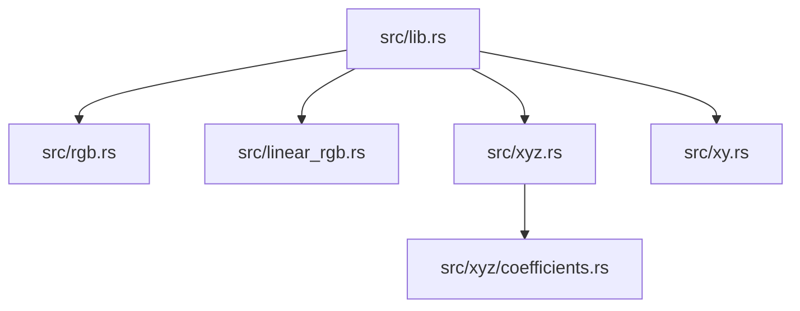
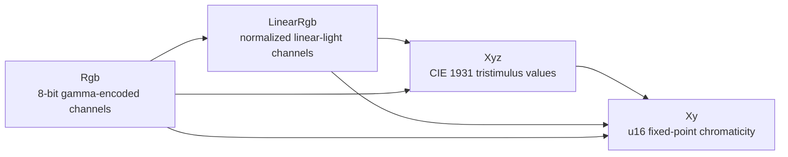

# Architecture

`bunt` is a small Rust library for deterministic color-space conversions. The
public API is exposed from `src/lib.rs` and consists of four value types:

- `Rgb`
- `LinearRgb`
- `Xyz`
- `Xy`

Each type owns its channel values and exposes simple constructors and accessors.
Conversions are implemented with standard `From` implementations so callers can
compose conversion steps explicitly or use the direct paths provided by the
crate.

## Module layout

## Conversion flow

## Responsibilities

`Rgb` stores 8-bit gamma-encoded channel values and defines common color
constants.

`LinearRgb` applies the sRGB transfer function to convert gamma-encoded channels
into normalized linear-light intensities.

`Xyz` applies the crate's RGB-to-XYZ coefficient matrix. The matrix rows are
represented by the private `Coefficients` helper.

`Xy` converts XYZ tristimulus values into chromaticity coordinates. The result is
stored as two fixed-point `u16` values scaled over the full `0..=u16::MAX`
range.

## Feature flags

The optional `serde` feature derives `Serialize` and `Deserialize` for the color
value types. The feature does not change conversion behavior.
